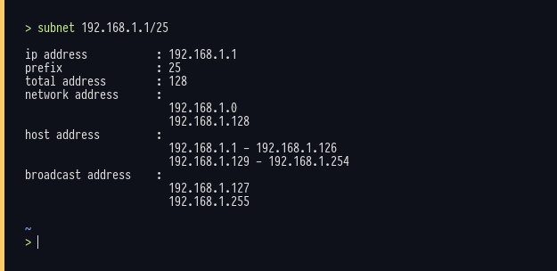

##  # Subnet #
<center>subnetting via command line</center>

## installation

#### intall from binary file

```bash
git clone https://github.com/nekonako/subnet.git
cd subnet
sudo ./install.sh
```

#### build manualy

```bash
git clone https://github.com/nekonako/subnet.git
cd subnet
go build 
```

## how to use

```bash
subnet 192.168.1.1/24
```

## image

<p align="center">
  
</p>
